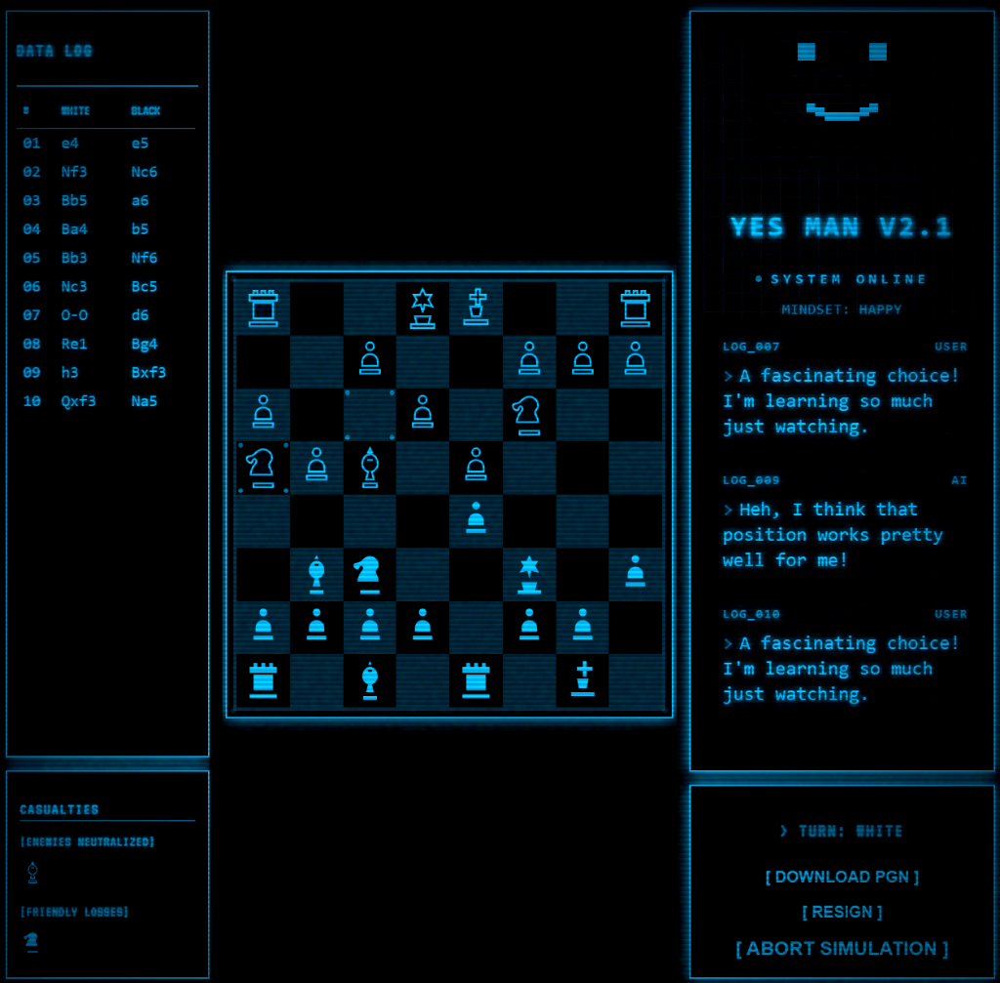

# Yes Man Chess Terminal

A retro-futuristic chess game with AI-powered commentary, customizable themes, and authentic CRT monitor effects.

> **Note**: This project uses [Stockfish](https://stockfishchess.org/) chess engine (GPL-3.0). See [Stockfish Attribution](docs/STOCKFISH_ATTRIBUTION.md) for details.




## 🔗 Source Code & Full Version

**Want to run the full AI-powered version?**
This web demo runs in "Offline Mode" with simulated responses. To enable the real-time generative AI commentary powered by Google Gemini, download the source code and add your own API key!

👉 **[Get the Source Code on GitHub](https://github.com/Samrude1/ChessAI)**

## 🎮 Features

### 🤖 Yes Man AI Opponent
- **Personality-Driven Commentary** - Yes Man reacts to every move with his characteristic cheerful, overly-helpful personality
- **Dual Modes**:
  - **Online Mode** (requires API Key): Real-time generative commentary powered by Google Gemini.
  - **Offline/Demo Mode**: Fully playable without an API key using a library of character-specific responses.
- **Context Awareness** - Reacts to checks, captures, and material changes.
- **Dynamic Moods** - Face and commentary change based on game state:
  - 😎 **Confident** - Winning position
  - 😊 **Happy** - Neutral game
  - 😰 **Nervous** - Losing slightly
  - 😱 **Panicking** - Desperate position
  - 🤔 **Calculating** - Thinking about moves
  - 🎉 **Excited** - Check or critical moments

### ♟️ Adjustable Difficulty
- **4 Difficulty Levels**: Beginner → Intermediate → Advanced → Master
- **Powered by Stockfish** - Professional-grade chess engine
- **Skill Range 0-20** - Fine-tune AI strength to your level

### 🎨 Retro Terminal Aesthetic
- **Customizable Theme** - Choose any color via hue slider (0-360°)
- **Authentic CRT Effects** - Scanlines, screen curvature, random glitches, and distortion
- **Pixelated Yes Man Face** - Retro pixel-art style with expressive animations
- **Monochrome Design** - True single-color terminal aesthetic

### 🎯 AI Commentary & Awareness
- **Human-Like Commentary**: Optimized for natural, short conversational responses (max 15 words) with genuine emotion.
- **Context Awareness**: Smarter checkmate detection (knows when it wins vs. loses) and tactical awareness.
- **Mood System**: Face and tone change dynamically based on game state (Confident, Worried, Desperate, etc.).

### 🎮 Gameplay Features
- **Move Validation** - Legal moves only, powered by chess.js
- **Move Highlighting** - Visual indicators for selected pieces and possible moves
- **Captured Pieces Display** - Track material advantage
- **Move History** - Full game notation
- **Resign Option** - Concede when needed

## � Documentation

- **[User Guide](docs/USER_GUIDE.md)** - Complete guide to playing and customizing the game
- **[Stockfish Attribution](docs/STOCKFISH_ATTRIBUTION.md)** - Chess engine credits and licensing
- **[Future Roadmap](docs/future_roadmap.md)** - Planned features and improvements

## �🚀 Getting Started

### Prerequisites
- Node.js 16+
- npm or yarn

### Installation

```bash
# Clone the repository
git clone <your-repo-url>
cd gemini-chess-commentary

# Install dependencies
npm install

# Set up environment variables
cp .env.example .env.local
# Add your Gemini API key to .env.local
```

### Environment Variables

Create a `.env.local` file:

```env
GEMINI_API_KEY=your_gemini_api_key_here
```

### Running the Game

```bash
# Development mode
npm run dev

# Build for production
npm run build

# Preview production build
npm run preview
```

## 🎮 How to Play

1. **Start Game** - Choose your color (White or Black)
2. **Select Difficulty** - Adjust the AI threat level slider (0-20)
3. **Make Moves** - Click a piece, then click where you want to move it
4. **Watch Yes Man React** - Enjoy his commentary and facial expressions
5. **Win or Learn** - Yes Man will congratulate or console you!

## 🛠️ Tech Stack

- **React 18** - UI framework
- **TypeScript** - Type safety
- **Vite** - Build tool
- **Tailwind CSS** - Styling
- **chess.js** - Chess logic and validation
- **Stockfish** - AI chess engine
- **Google Gemini AI** - Natural language commentary generation

## 📁 Project Structure

```
gemini-chess-commentary/
├── components/
│   ├── AICommentary.tsx      # Yes Man monitor and commentary
│   ├── Chessboard.tsx         # Interactive chess board
│   ├── YesManFace.tsx         # Pixelated animated face
│   ├── GameStartModal.tsx     # Difficulty selector
│   ├── MoveHistory.tsx        # Game notation
│   └── CapturedPieces.tsx     # Material tracker
├── services/
│   ├── chessEngine.ts         # Stockfish integration
│   ├── geminiService.ts       # AI commentary generation
│   └── soundService.ts        # Audio effects
├── constants.tsx              # Chess piece SVGs
└── App.tsx                    # Main application
```

## 🎨 Customization

### Color Theme
The UI features a **customizable monochrome terminal theme**:
- **Hue Slider** - Choose any color from 0-360° on the start menu
- **Dynamic** - All UI elements update instantly with theme changes

### CRT Monitor Effects
Authentic retro CRT monitor effects:
- **Scanlines** - Horizontal scan lines overlay
- **Screen Curvature** - Subtle vignette effect
- **Random Glitches** - Occasional screen shake (every ~25s)
- **Distortion** - Periodic blur/contrast shifts (every ~30s)
- **Noise** - Animated static overlay

Adjust effect intensity in `index.html` CSS animations.

### AI Personality
Modify Yes Man's personality in `services/geminiService.ts`:
- Adjust commentary style
- Change mood-based responses
- Customize robot sounds and glitches

### Difficulty Levels
Adjust AI strength in `components/GameStartModal.tsx`:
- Modify skill level ranges (1-20)
- Change difficulty labels

## 🐛 Known Issues

- Stockfish worker may take a moment to initialize on first load
- AI commentary requires active internet connection (Gemini API)

## 📝 License

This project is open source and available under the MIT License.

## 🙏 Credits & Attribution

### Chess Engine
This project uses **[Stockfish](https://stockfishchess.org/)** - one of the strongest open-source chess engines in the world.

- **License**: GNU General Public License v3.0 (GPL-3.0)
- **Version**: 16.1 (WASM build)
- **Repository**: https://github.com/official-stockfish/Stockfish
- **Full Attribution**: See [docs/STOCKFISH_ATTRIBUTION.md](docs/STOCKFISH_ATTRIBUTION.md)

**Important**: Stockfish is NOT owned by this project. It is developed and maintained by the Stockfish team. This project uses the official pre-compiled WebAssembly build without modifications.

### Other Technologies
- **AI Commentary** - [Google Gemini API](https://ai.google.dev/)
- **Chess Logic** - [chess.js](https://github.com/jhlywa/chess.js)
- **UI Framework** - [React 18](https://react.dev/)
- **Styling** - [Tailwind CSS](https://tailwindcss.com/)
- **Build Tool** - [Vite](https://vitejs.dev/)

### Inspiration
- **Yes Man Character** - Fallout: New Vegas (Bethesda/Obsidian Entertainment)
- **Retro Terminal Aesthetic** - Classic CRT monitors and vintage computing

## 🎯 Future Enhancements

- [ ] Save/Load games
- [ ] Game analysis mode
- [ ] Multiple AI personalities
- [ ] Online multiplayer
- [ ] Opening book integration
- [ ] Puzzle mode

---

**Enjoy playing chess against Yes Man!** 🤖♟️

*"I'm programmed to help you win... or at least try really hard!"* - Yes Man
